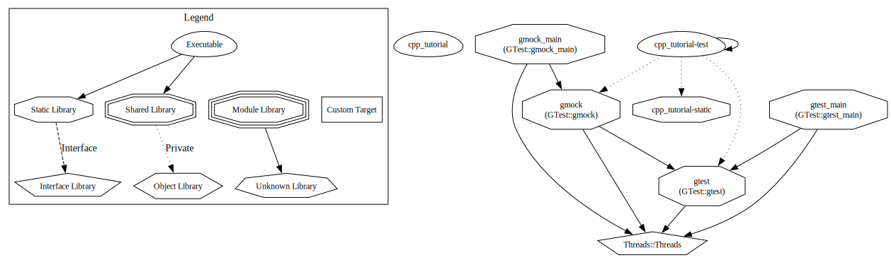

# cpp-tutorial

Source code for "Project from scratch series"
- On YouTube: [https://youtube.com/cppdev](https://www.youtube.com/watch?v=fBmi7yJOwC8&list=PLSGsTSSx2DyM8q6gM_cUVwX_da1tTYLrq)
- On Wordpress: [https://thecppdev.com/](https://thecppdev.com/category/project-from-scratch/)

## Building the project (with cmake)
mkdir build && cd build && cmake .. && make

## Building with test cases (with cmake)
Just use -DBUILD_TESTS=ON option for cmake.
mkdir build && cd build && cmake -DBUILD_TESTS=ON .. && make

### the graphviz shows the project organization as below (gtest)

